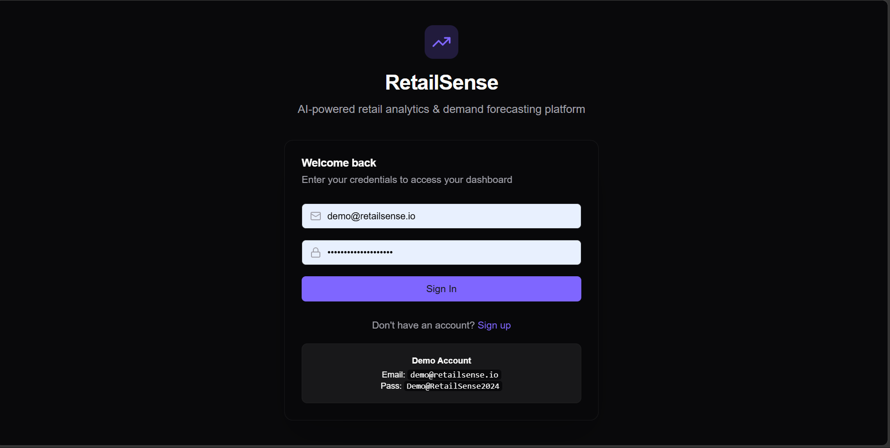
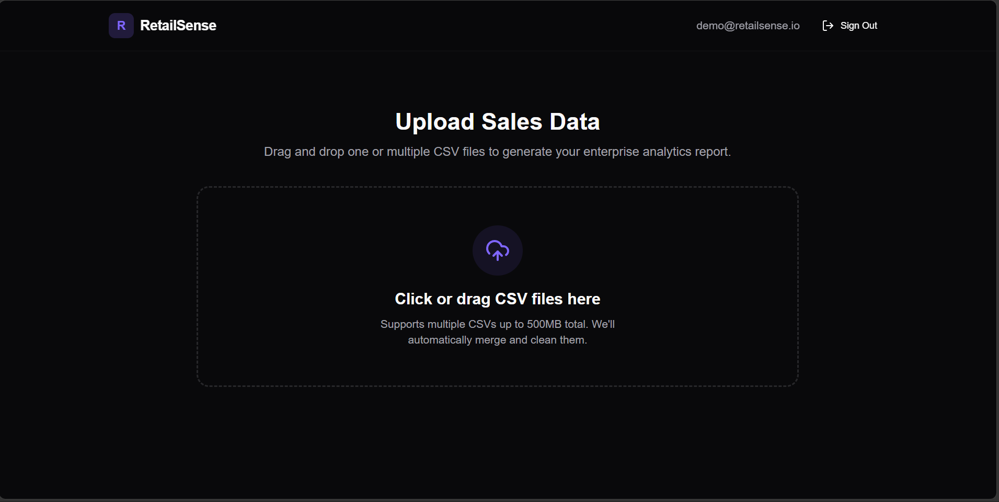
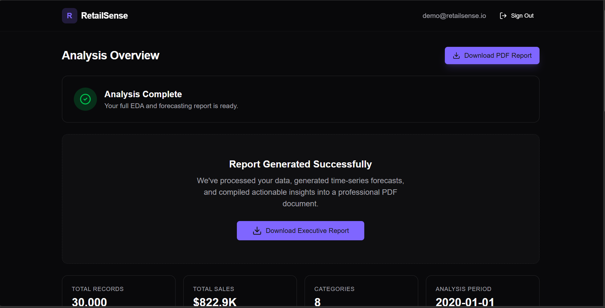
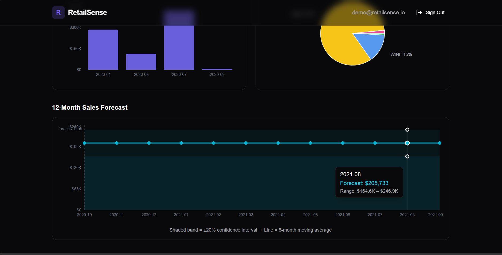
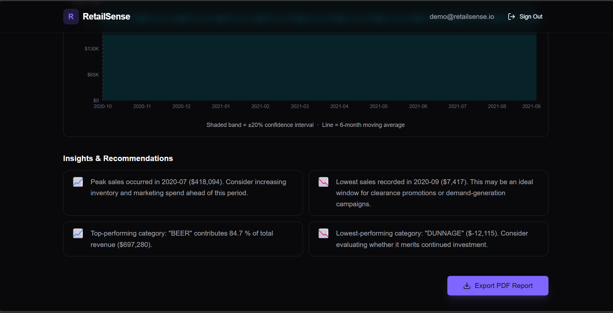
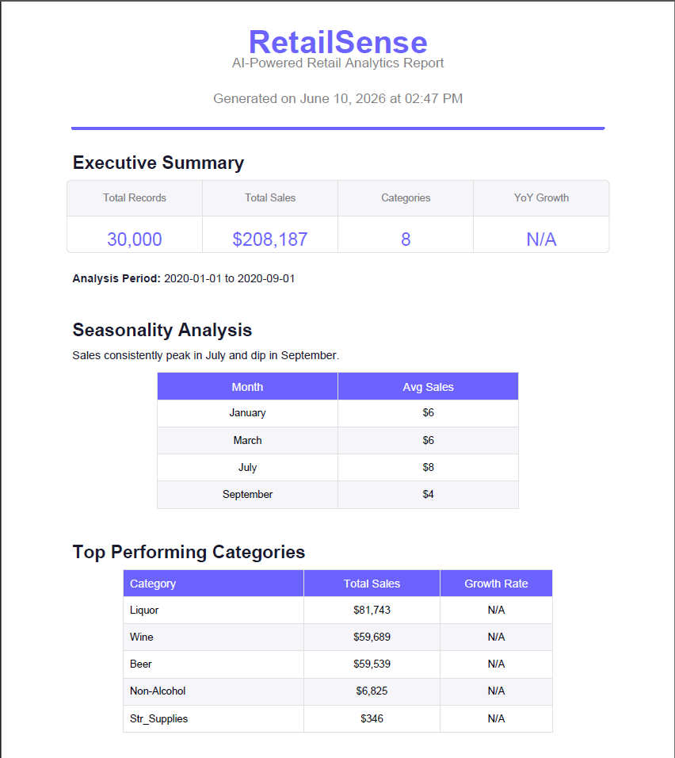
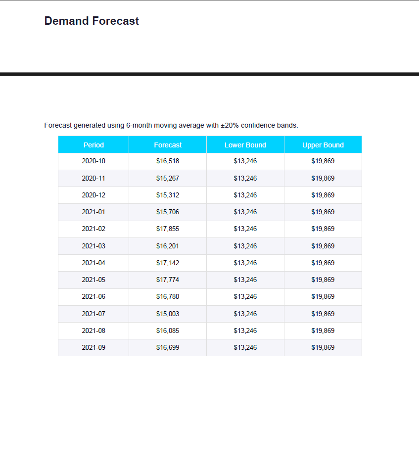
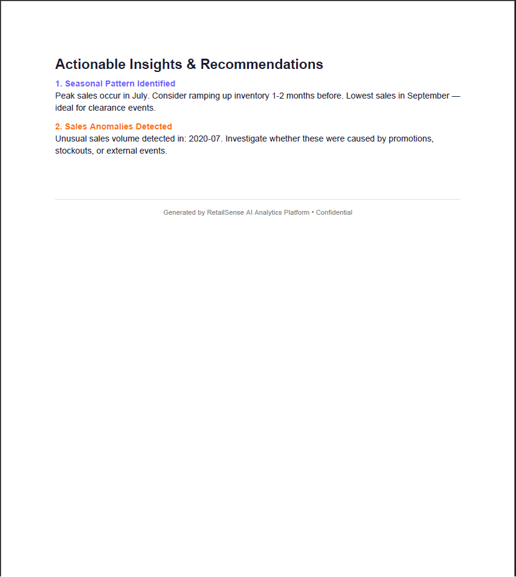

#  RetailSense Task-3 (Retail Sales Analysis & Forecasting)

AI-powered retail analytics, forecasting, and decision-support platform. RetailSense allows users to upload raw retail sales CSVs, auto-detects date/sales/category schemas, cleans the dataset, and drives two distinct analytical pipelines:
1. **Interactive Analytics Dashboard (Synchronous /api/analyze)**: Instant visual summary, interactive charts for monthly trends (with statistical anomaly detection), category distributions, a 12-month demand forecast (moving average with confidence bands), and heuristic-driven recommendations.
2. **Asynchronous PDF Generation (Celery Pipeline)**: Background execution using Celery & Redis to perform thorough data cleaning, run **Facebook Prophet** time-series modeling (with 95% confidence intervals), and compile an executive-ready ReportLab PDF.

---

### User Flow Screenshots
To get started, users sign in with secure credentials, upload one or multiple CSV files via a drag-and-drop zone, and see the interactive dashboard alongside PDF download capabilities.

|  User Authentication |  Drag & Drop Upload Zone |
| :---: | :---: |
|  |  |

---

##  Features

- **Multi-File CSV Upload & Merging**: Drag-and-drop one or multiple CSV sales exports (up to 500MB total). The system auto-merges, standardizes column structures, and handles parsing.
- **Smart Data Cleaning**: Automatic type coercion, parsing of explicit `YEAR`/`MONTH` or implicit date columns, removal of currency symbols/thousands separators, and missing value cleanup.
- **Dual Processing Pipelines**:
  - **Real-Time API Analysis**: Quick, stateless CSV upload to `/api/analyze` returning instant JSON payload to power the on-screen dashboard.
  - **Async Celery Report Engine**: Multi-stage background worker process mapping data through EDA, Prophet forecasting, and compiling a structured ReportLab PDF.
- **Interactive Analytics Dashboard**:
  - **KPI Metrics Grid**: Displays total records, net sales, unique categories, and detected analysis time range.
  - **Monthly Trend Chart**: Renders monthly sales data. It automatically highlights business anomalies (bars colored in red) using a standard deviation metric ($> 2\sigma$ deviation).
  - **Category Breakdown Pie Chart**: Shows category contributions using custom dynamic palettes, listing percentage share on hover.
  - **12-Month Sales Forecast Chart**: Outlines future predictions utilizing a composed area and line chart depicting a shaded $\pm20\%$ confidence interval.
  - **Insights & Recommendations Engine**: Automatically generates actionable textual cards identifying peak periods, lowest sales windows, YoY growth/decline rate, and top/bottom categories.

### Dashboard Showcase


#### Detailed Visual Components
|  Monthly Sales Trend (Anomaly Detection) |  12-Month Sales Forecasting |
| :---: | :---: |
|  |  |

|  Automated Insights & Recommendations |
| :---: |
|  |

- **Executive PDF Report**: Compiles all insights, KPIs, seasonality trends, and forecasts into a beautifully styled, multi-page print-ready PDF using **ReportLab** (featuring tables, page numbers, and custom colors).

#### PDF Report Preview
|  Page 1 — Overview & KPIs |  Page 2 — Category Breakdown |  Page 3 — Forecast & Insights |
| :---: | :---: | :---: |
|  |  |  |

---

##  Architecture & Tech Stack

RetailSense is built using a modern, decoupled stack optimized for high-performance data processing, time-series forecasting, and interactive web visualization:

###  Frontend
| Technology | Purpose | Version |
|---|---|---|
| **React** | Interactive UI layer & component lifecycle | `^19.2.6` |
| **Vite** | Fast frontend build tooling & hot-module reloading | `^8.0.12` |
| **TypeScript** | Static typing for reliable code quality | `~6.0.2` |
| **Recharts** | Fully interactive SVG-based charts (Bar, Pie, Composed, Line, Area) | `^3.8.1` |
| **Tailwind CSS** | Utility-first styling engine with theme variables | `^4.3.0` |
| **shadcn/ui + Lucide Icons** | Premium accessible UI primitives and responsive vector iconography | - |
| **TanStack Query** | Client-side server state management and background status polling | `^5.101.0` |
| **Axios** | HTTP client with automatic JWT bearer token headers injection | `^1.17.0` |
| **react-dropzone** | Drag-and-drop component for simple file handling | `^15.0.0` |

###  Backend
| Technology | Purpose | Version |
|---|---|---|
| **FastAPI** | High-performance asynchronous API framework | `0.111.0` |
| **Uvicorn** | ASGI web server for running the FastAPI application | `0.29.0` |
| **SQLAlchemy** | SQL Toolkit and Object-Relational Mapper (ORM) | `2.0.30` |
| **Celery** | Asynchronous task queue for executing heavy pipeline jobs | `5.4.0` |
| **Redis** | In-memory key-value message broker & result backend for Celery | `5.0.4` |
| **Pandas** | High-performance data structures and cleaning engine | `2.2.2` |
| **NumPy** | Scientific computing and array operations | `1.26.4` |
| **Facebook Prophet** | Advanced additive regression time-series forecasting model | `1.1.5` |
| **scikit-learn + scipy** | Mathematical computation & statistical modeling | - |
| **ReportLab** | Enterprise PDF document generation engine | `4.1.0` |
| **python-jose + passlib** | Secure JWT cryptography & blowfish (bcrypt) password hashing | - |

###  Infrastructure
| Technology | Purpose | Version |
|---|---|---|
| **Docker & Compose** | Containerized multi-service orchestration | Compose v2+ |
| **PostgreSQL 15** | Primary relational database store | `15` |
| **Redis 7** | Broker and backend storage caching server | `7` |

---

##  Quick Start (Docker Compose — Recommended)

The easiest way to run the entire enterprise stack (PostgreSQL, Redis, Celery Worker, FastAPI, and React Frontend) in one command:

```bash
# From the project root directory
docker-compose up --build -d
```

### Accessing the Application
| Service | URL |
|---|---|
| **Frontend Dashboard** | http://localhost:5173 |
| **Backend API** | http://localhost:8000 |
| **API Interactive Docs** | http://localhost:8000/docs |

###  Demo Account
A demo account is automatically seeded into the database on first startup:
- **Email**: `demo@retailsense.io`
- **Password**: `Demo@RetailSense2024`

### Stopping the Stack
```bash
docker-compose down
```

---

##  Running Locally (Manual Setup)

If you prefer to run the components directly on your system without Docker:

### Prerequisites
- Python 3.11+
- Node.js 20+
- PostgreSQL 15+
- Redis Server 7+

### 1. Database & Redis Setup
- Start PostgreSQL and create a database named `retailsense`.
- Start Redis (default port `6379`).

### 2. Configure Environment
```bash
# From the project root
cp backend/.env.example backend/.env
```
Open `backend/.env` and verify the connection strings for your local PostgreSQL and Redis instances.

### 3. Install & Run the Backend API
```bash
cd backend
python -m venv venv

# Windows:
venv\Scripts\activate

# macOS/Linux:
# source venv/bin/activate

pip install -r requirements.txt
uvicorn main:app --host 127.0.0.1 --port 8000 --reload
```

### 4. Run the Celery Worker
In a **new terminal** (with the same virtual environment activated):
```bash
cd backend
celery -A worker.celery_app worker --loglevel=info
```

### 5. Run the Frontend Development Server
In a **new terminal**:
```bash
cd frontend
npm install
npm run dev
```

Open [http://localhost:5173](http://localhost:5173) to view the application.

---

##  Project Structure

```
RetailSense/
├── backend/
│   ├── main.py              # FastAPI application entry point
│   ├── config.py            # Pydantic settings (reads .env)
│   ├── database.py          # SQLAlchemy engine & session setup
│   ├── models.py            # ORM models (User, Dataset, Report)
│   ├── schemas.py           # Pydantic request/response schemas
│   ├── auth.py              # JWT auth logic & password hashing
│   ├── pipeline.py          # CSV cleaning & EDA pipeline helper
│   ├── forecasting.py       # Prophet & moving average forecasting model
│   ├── pdf_generator.py     # ReportLab PDF report generator
│   ├── tasks.py             # Celery task definitions
│   ├── worker.py            # Celery app configuration (with retry-on-startup support)
│   ├── setup_demo_user.py   # Seeding utility to manually create the demo user
│   ├── requirements.txt     # Python dependencies
│   ├── Dockerfile           # Backend Docker image
│   └── routers/
│       ├── __init__.py      # Routers package initialization
│       ├── auth_router.py   # /api/auth endpoints (Login, Signup, Profile)
│       ├── upload_router.py # /api/datasets endpoints (Upload, Status, Delete)
│       ├── report_router.py # /api/reports endpoints (Get Report metadata, PDF Download)
│       └── analyze_router.py # /api/analyze endpoint (Stateless CSV analysis for dashboard)
├── frontend/
│   ├── src/
│   │   ├── pages/
│   │   │   ├── Login.tsx    # Login & signup page
│   │   │   └── Dashboard.tsx# Main upload page (triggers analyze + datasets upload)
│   │   ├── components/
│   │   │   ├── ResultsDashboard.tsx # Interactive dashboard visualizing API results
│   │   │   └── ui/          # Reusable shadcn/ui components (button, card, input)
│   │   ├── lib/
│   │   │   ├── api.ts       # Axios client with request authorization interceptors
│   │   │   └── utils.ts     # Utility functions (cn class merging helper)
│   │   ├── App.css          # Global App styles
│   │   ├── index.css        # Tailwind CSS imports
│   │   ├── App.tsx          # App router and authentication guard
│   │   └── main.tsx         # React root mounting point
│   ├── vite.config.ts       # Vite config + API proxy configuration
│   ├── Dockerfile           # Frontend Docker image
│   ├── package.json         # Frontend dependencies and scripts
│   └── tsconfig.json        # TypeScript configuration
├── Images/                  # Application screenshots directory
│   ├── Login.png
│   ├── Upload.png
│   ├── Dashboard.png
│   ├── monthly sales .png
│   ├── Forcasting.png
│   ├── Insights.png
│   ├── Report1.png
│   ├── Report2.png
│   └── Report3.png
├── docker-compose.yml       # Multi-service orchestration configuration
└── README.md                # Project documentation
```

---

##  Supported CSV Formats

The pipeline auto-detects and handles:
- **Date columns**: Any column named `date`, `order_date`, `transaction_date`, `ship_date`, etc.
- **Year/Month columns**: Separate `YEAR` and `MONTH` integer columns (e.g., Retail & Warehouse datasets).
- **Sales columns**: Any column containing `sales`, `revenue`, `amount`, `profit`, or `transfers`.
- **Category columns**: Any column named `item type`, `category`, `product_category`, or `sub-category`.
- **Currency formats**: Values prefixed with `$`, `€`, `£` or containing commas are automatically stripped and converted to numeric.
